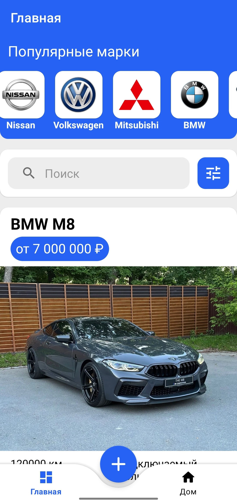
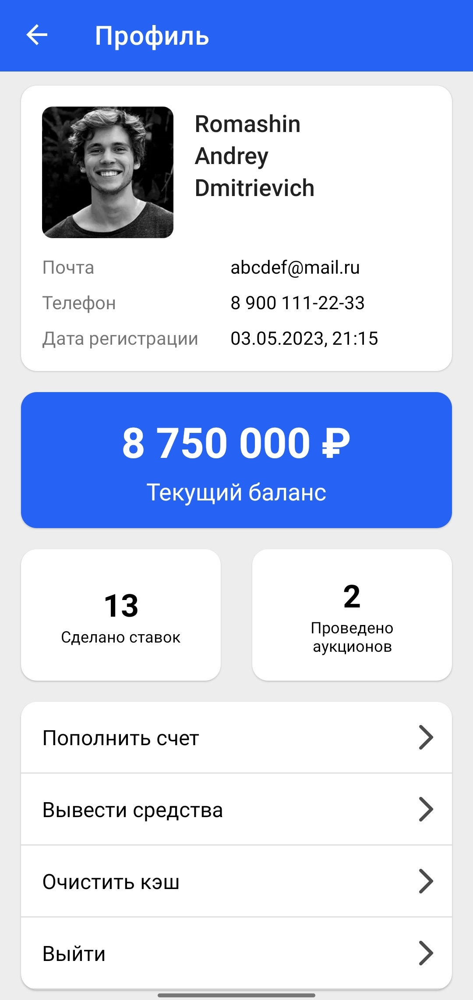
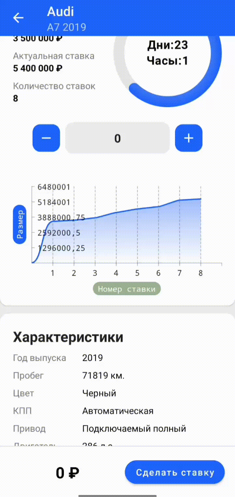
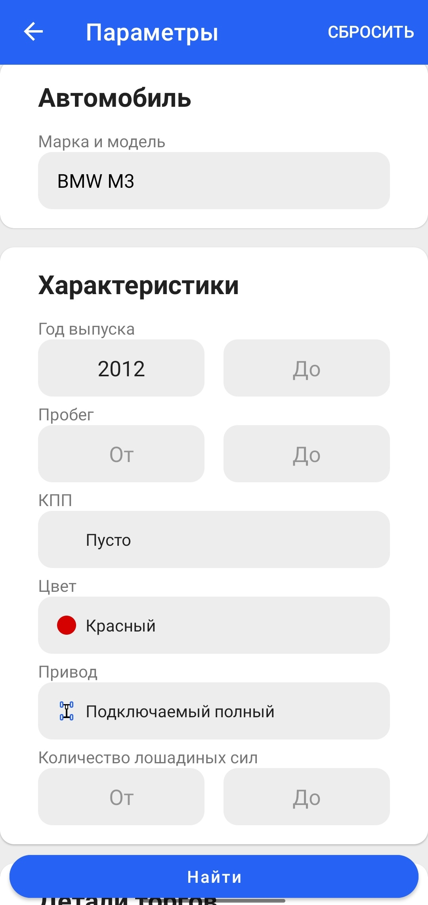

# CarTrader

  

This application is one of the parts of my [graduation project](Диплом_final_version.pdf).

CarTrader is an application for the auction sale of cars. It allows both to participate in auctions and to put your own car up for sale.

## 🛠️ Stack

### Network
* [Retrofit](https://square.github.io/retrofit/)
* [Ktor webSocket](https://github.com/ktorio/ktor/tree/main)
* [Kotlinx serialization](https://github.com/Kotlin/kotlinx.serialization)
* JWT authentication
* [Glide](https://github.com/bumptech/glide)

### Database
* [Room](https://developer.android.com/jetpack/androidx/releases/room)

### UI
* View
* Little bit Compose
* [Lottie](https://github.com/airbnb/lottie-android)
* [Vico](https://github.com/patrykandpatrick/vico)

### DI
* [Dagger 2](https://github.com/google/dagger)

## 📷 Screenshots

  
  
  
  
  
  

